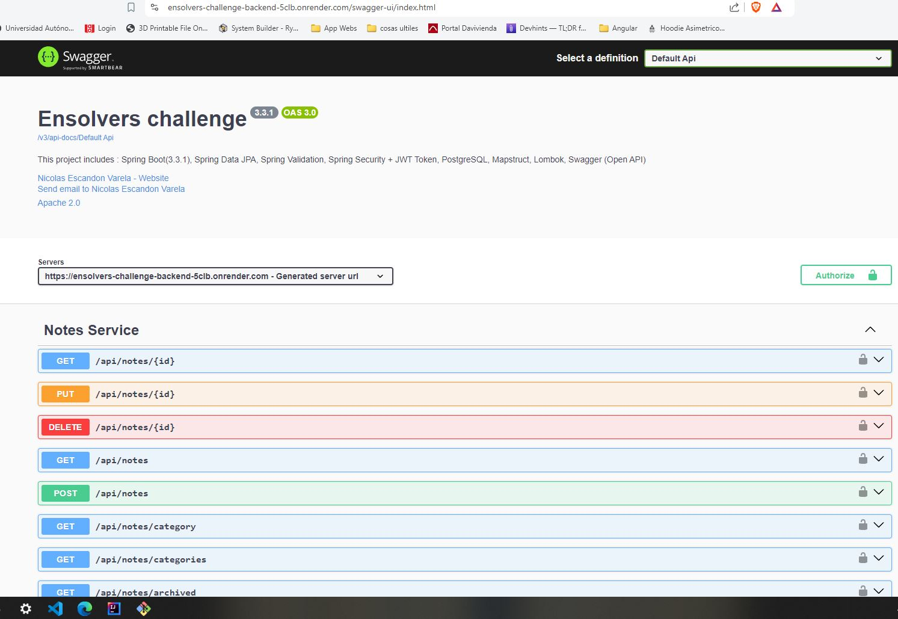

# Project-Challenge

This is a project I made as part of an interview process. I haven’t received a reply from the company, so I want to post this project (I actually like it… just a little).

You can see the requirements in the CHALLENGE.md file. I won't reveal the company's name, and since I didn’t sign anything, I guess I can share it.

For the solution to this challenge, I have used the Java Spring Boot framework, along with a PostgreSQL database. For the frontend, I have used Next.js 14

To streamline the development of this challenge, I have used an open-source Spring Boot boilerplate. Additionally, for the Next.js 14 project, I started the project directly using TailwindCSS and the NextUI library for styling.

At the end of the README, you will find the respective credits and links for each of these projects.

## Backend Tecnologies:
- Spring Boot (v3.3.1)
- Spring Data JPA
- Spring Validation
- Spring Security + JWT Token
- PostgreSQL
- Mapstruct
- Lombok
- Swagger (Open API)
- JDK 17 o superior
- Maven 3.8.x
- Gradle 8.x
- PostgreSQL 15.x

## Frontend Technologies
- Node.js 18.x
- yarn 1.22.x
- [Next.js 14](https://nextjs.org/docs/getting-started)
- [NextUI v2](https://nextui.org/)
- [Tailwind CSS](https://tailwindcss.com/)
- [Tailwind Variants](https://tailwind-variants.org)
- [TypeScript](https://www.typescriptlang.org/)
- [Framer Motion](https://www.framer.com/motion/)
- [next-themes](https://github.com/pacocoursey/next-themes)

## Local Instalation (Docker Needed)

Run Docker Compose; there's no need to install anything besides Docker.

    docker-compose up

## Project Breakdown

It has JWT Authentication:

  

Username: 
    
    admin
    
Password: 

    123qwe

Front end url:

    http://localhost:3000/

  

Back end url (swagger):

    http://localhost:8080/swagger-ui/index.html

  

## Acknowledgments
SpringBootBoilerplate  [SpringBootBoilerplate](https://github.com/Genc/spring-boot-boilerplate)

Next14 + NextUi [NextUI v2](https://nextui.org/)
